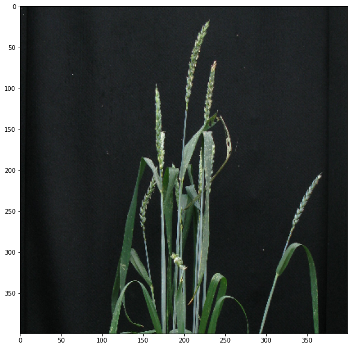
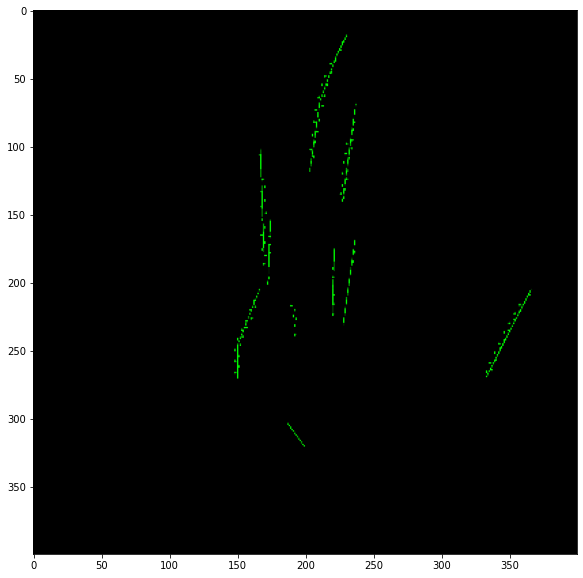
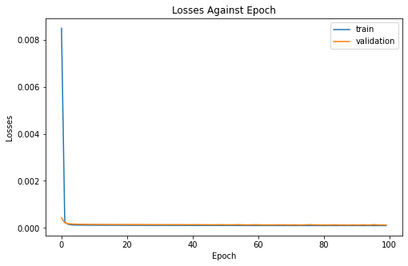
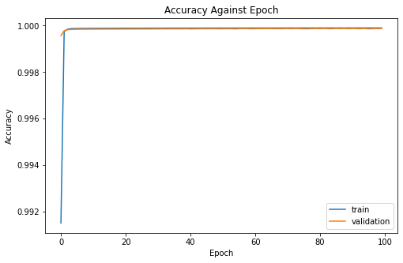
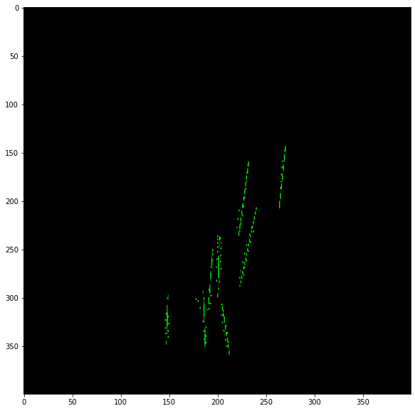
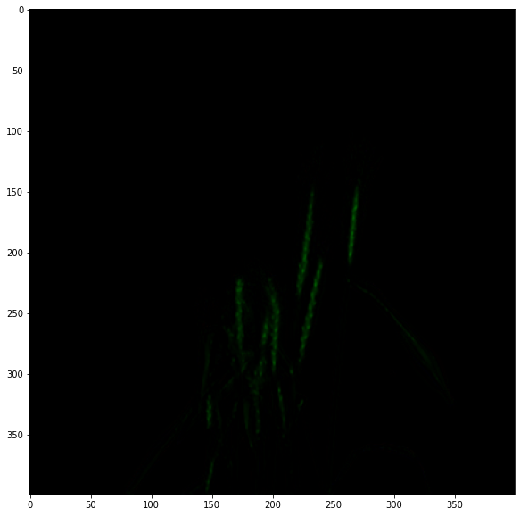
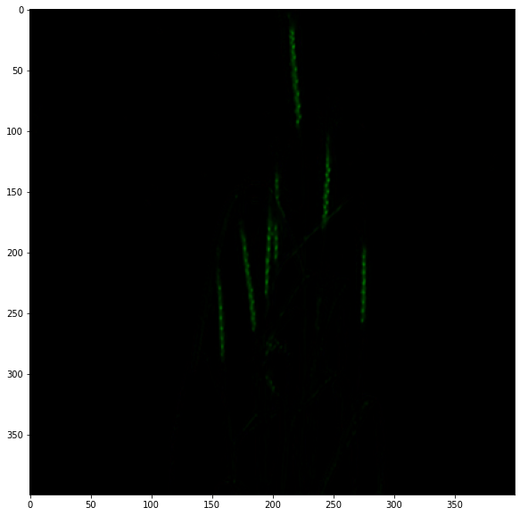

# IMPORT RELEVANT LIBRARIES


```python
import warnings
warnings.filterwarnings("ignore")

from scipy import misc
import json
import numpy as np
import cv2
import os
import imageio
import torch
from torch.utils.data import Dataset, DataLoader
from torchvision import transforms, datasets, models
from torchvision.transforms import Resize, ToTensor
import torch
import torch.nn as nn
from torch.autograd import Variable
import matplotlib.pyplot as plt
import torch.optim as optim
import torch.nn.functional as F
from torch.optim.lr_scheduler import StepLR
```


```python
from google.colab import drive
drive.mount('/content/drive')
```

    Mounted at /content/drive
    


```python
#!unzip -uq "/content/drive/My Drive/AC-Dataset/acid-dataset-training.zip" -d "/content/drive/My Drive/input/acid-dataset-training"
#!unzip -uq "/content/drive/My Drive/AC-Dataset/acid-dataset-validation.zip" -d "/content/drive/My Drive/input/acid-dataset-validation"
```

# Dataset class for both image and mask. 
This makes it easy to load the data in batches during training


```python
class Wheat(Dataset):
    def __init__(self, mode='train'):
        self.mode = mode
        if self.mode=='train':
            self.path = '/content/drive/My Drive/input/acid-dataset-training/wheat2017'
        elif self.mode=='val':
            self.path = '/content/drive/My Drive/input/acid-dataset-validation/wheat2017'
        else:
            print('mode should be either train or val!')
        self.namelist = os.listdir(self.path)
        
    def __getitem__(self, index):
        name = self.namelist[index]
        img, mask = self.read_img_mask(name)
        img = cv2.resize(img, dsize=(400, 400)) #, interpolation=cv2.INTER_CUBIC)
        mask = cv2.resize(mask, dsize=(400,400)) #, interpolation=cv2.INTER_CUBIC)
        aug = transforms.Compose([transforms.ToTensor()]) # transform img to tensor in range [0,1]
        img, mask = aug(img), aug(mask)
        return img , mask
    
    def __len__(self):
        return len(self.namelist)
    
    def read_img_mask(self, name):
        img = imageio.imread('%s/%s/%s.jpg'%(self.path, name, name))
      
        json_data = json.load(open('%s/%s/%s.json'%(self.path, name, name),'r'))
        mask = np.zeros(img.shape, np.uint8)
        
        for each in json_data['data']:
            name = each['Name']
            if name=='Awns': continue
            Type = each['Type']
            points = [tuple(map(lambda x: int(float(x)), p.split(','))) for p in each['Points']]
            color = (0,255,0) if name=='Ear' else (0,255,0)
            point_size = 2
            thickness = 2
            if Type=='Point':
                for p in points:
                    cv2.circle(mask, p, point_size, color, thickness)
            else:
                cv2.polylines(mask, [np.array(points)], False, color, thickness)

        mask = imageio.imwrite('mask.png', mask)
        mask = imageio.imread('mask.png')
        return img, mask
        
dataset = Wheat('train') # dataset for train set 

# a random pair
img, mask = dataset[np.random.randint(0, len(dataset))]
img.shape, mask.shape
```


    (torch.Size([3, 400, 400]), torch.Size([3, 400, 400]))


# Example image and mask


```python
plt.figure(figsize=(10,10))
plt.imshow(img.permute(1, 2, 0))
```


    <matplotlib.image.AxesImage at 0x7f5c01178278>





```python
plt.figure(figsize=(10,10))
plt.imshow(mask.permute(1, 2, 0))
```


    <matplotlib.image.AxesImage at 0x7f5c00ccbd68>





# Defining the dataloader for the wheat dataset


```python
from torch.utils.data.sampler import SubsetRandomSampler
train_indices = torch.LongTensor(100).random_(0, 415)
val_indices = torch.LongTensor(30).random_(0, 415)

train_loader = DataLoader(Wheat('train'), batch_size=8, sampler=SubsetRandomSampler(train_indices))
val_loader = DataLoader(Wheat('train'), batch_size=4, sampler=SubsetRandomSampler(train_indices)) 
```

# The UNet Model


```python
class DoubleConv(nn.Module):
    """(convolution => [BN] => ReLU) * 2"""

    def __init__(self, in_channels, out_channels):
        super().__init__()
        self.double_conv = nn.Sequential(
            nn.Conv2d(in_channels, out_channels, kernel_size=3, padding=1),
            nn.BatchNorm2d(out_channels),
            nn.ReLU(inplace=True),
            nn.Conv2d(out_channels, out_channels, kernel_size=3, padding=1),
            nn.BatchNorm2d(out_channels),
            nn.ReLU(inplace=True)
        )

    def forward(self, x):
        return self.double_conv(x)


class Down(nn.Module):
    """Downscaling with maxpool then double conv"""

    def __init__(self, in_channels, out_channels):
        super().__init__()
        self.maxpool_conv = nn.Sequential(
            nn.MaxPool2d(2),
            DoubleConv(in_channels, out_channels)
        )

    def forward(self, x):
        return self.maxpool_conv(x)


class Up(nn.Module):
    """Upscaling then double conv"""

    def __init__(self, in_channels, out_channels, bilinear=True):
        super().__init__()

        # if bilinear, use the normal convolutions to reduce the number of channels
        if bilinear:
            self.up = nn.Upsample(scale_factor=2, mode='bilinear', align_corners=True)
        else:
            self.up = nn.ConvTranspose2d(in_channels // 2, in_channels // 2, kernel_size=2, stride=2)

        self.conv = DoubleConv(in_channels, out_channels)

    def forward(self, x1, x2):
        x1 = self.up(x1)
        # input is CHW
        diffY = torch.tensor([x2.size()[2] - x1.size()[2]])
        diffX = torch.tensor([x2.size()[3] - x1.size()[3]])

        x1 = F.pad(x1, [diffX // 2, diffX - diffX // 2,
                        diffY // 2, diffY - diffY // 2])
        x = torch.cat([x2, x1], dim=1)
        return self.conv(x)


class OutConv(nn.Module):
    def __init__(self, in_channels, out_channels):
        super(OutConv, self).__init__()
        self.conv = nn.Conv2d(in_channels, out_channels, kernel_size=1)

    def forward(self, x):
        return self.conv(x)

class UNet(nn.Module):
    def __init__(self, n_channels, n_classes, bilinear=True):
        super(UNet, self).__init__()
        self.n_channels = n_channels
        self.n_classes = n_classes
        self.bilinear = bilinear

        self.inc = DoubleConv(n_channels, 64)
        self.down1 = Down(64, 128)
        self.down2 = Down(128, 256)
        self.down3 = Down(256, 512)
        self.down4 = Down(512, 512)
        self.up1 = Up(1024, 256, bilinear)
        self.up2 = Up(512, 128, bilinear)
        self.up3 = Up(256, 64, bilinear)
        self.up4 = Up(128, 64, bilinear)
        self.outc = OutConv(64, n_classes)

    def forward(self, x):
        x1 = self.inc(x)
        x2 = self.down1(x1)
        x3 = self.down2(x2)
        x4 = self.down3(x3)
        x5 = self.down4(x4)
        x = self.up1(x5, x4)
        x = self.up2(x, x3)
        x = self.up3(x, x2)
        x = self.up4(x, x1)
        logits = self.outc(x)
        return logits
```

# The FCNN Model


```python
class FCNN(nn.Module):
    def __init__(self, n_classes=21, learned_billinear=False):
        super(FCNN, self).__init__()
        self.learned_billinear = learned_billinear
        self.n_classes = n_classes
        #self.loss = functools.partial(cross_entropy2d, size_average=False)

        self.conv_block1 = nn.Sequential(
            nn.Conv2d(3, 64, 3, padding=100),
            nn.ReLU(inplace=True),
            nn.Conv2d(64, 64, 3, padding=1),
            nn.ReLU(inplace=True),
            nn.MaxPool2d(2, stride=2, ceil_mode=True),
        )

        self.conv_block2 = nn.Sequential(
            nn.Conv2d(64, 128, 3, padding=1),
            nn.ReLU(inplace=True),
            nn.Conv2d(128, 128, 3, padding=1),
            nn.ReLU(inplace=True),
            nn.MaxPool2d(2, stride=2, ceil_mode=True),
        )

        self.conv_block3 = nn.Sequential(
            nn.Conv2d(128, 256, 3, padding=1),
            nn.ReLU(inplace=True),
            nn.Conv2d(256, 256, 3, padding=1),
            nn.ReLU(inplace=True),
            nn.Conv2d(256, 256, 3, padding=1),
            nn.ReLU(inplace=True),
            nn.MaxPool2d(2, stride=2, ceil_mode=True),
        )

        self.conv_block4 = nn.Sequential(
            nn.Conv2d(256, 512, 3, padding=1),
            nn.ReLU(inplace=True),
            nn.Conv2d(512, 512, 3, padding=1),
            nn.ReLU(inplace=True),
            nn.Conv2d(512, 512, 3, padding=1),
            nn.ReLU(inplace=True),
            nn.MaxPool2d(2, stride=2, ceil_mode=True),
        )

        self.conv_block5 = nn.Sequential(
            nn.Conv2d(512, 512, 3, padding=1),
            nn.ReLU(inplace=True),
            nn.Conv2d(512, 512, 3, padding=1),
            nn.ReLU(inplace=True),
            nn.Conv2d(512, 512, 3, padding=1),
            nn.ReLU(inplace=True),
            nn.MaxPool2d(2, stride=2, ceil_mode=True),
        )

        self.classifier = nn.Sequential(
            nn.Conv2d(512, 4096, 7),
            nn.ReLU(inplace=True),
            nn.Dropout2d(),
            nn.Conv2d(4096, 4096, 1),
            nn.ReLU(inplace=True),
            nn.Dropout2d(),
            nn.Conv2d(4096, self.n_classes, 1),
        )

        if self.learned_billinear:
            raise NotImplementedError

    def forward(self, x):
        conv1 = self.conv_block1(x)
        conv2 = self.conv_block2(conv1)
        conv3 = self.conv_block3(conv2)
        conv4 = self.conv_block4(conv3)
        conv5 = self.conv_block5(conv4)

        score = self.classifier(conv5)

        out = F.upsample(score, x.size()[2:])

        return out

    def init_vgg16_params(self, vgg16, copy_fc8=True):
        blocks = [
            self.conv_block1,
            self.conv_block2,
            self.conv_block3,
            self.conv_block4,
            self.conv_block5,
        ]

        ranges = [[0, 4], [5, 9], [10, 16], [17, 23], [24, 29]]
        features = list(vgg16.features.children())

        for idx, conv_block in enumerate(blocks):
            for l1, l2 in zip(features[ranges[idx][0] : ranges[idx][1]], conv_block):
                if isinstance(l1, nn.Conv2d) and isinstance(l2, nn.Conv2d):
                    assert l1.weight.size() == l2.weight.size()
                    assert l1.bias.size() == l2.bias.size()
                    l2.weight.data = l1.weight.data
                    l2.bias.data = l1.bias.data
        for i1, i2 in zip([0, 3], [0, 3]):
            l1 = vgg16.classifier[i1]
            l2 = self.classifier[i2]
            l2.weight.data = l1.weight.data.view(l2.weight.size())
            l2.bias.data = l1.bias.data.view(l2.bias.size())
        n_class = self.classifier[6].weight.size()[0]
        if copy_fc8:
            l1 = vgg16.classifier[6]
            l2 = self.classifier[6]
            l2.weight.data = l1.weight.data[:n_class, :].view(l2.weight.size())
            l2.bias.data = l1.bias.data[:n_class]
```


```python

```

# Training


```python
model =  UNet(n_channels=3,n_classes=3).to('cuda')
#model = FCNN(n_classes=3).to('cuda')
#model.load_state_dict(torch.load('/content/model_UNet_400_20.pt'))
```


```python
device= 'cuda'

criterion = nn.MSELoss()
optimizer = optim.Adam([p for p in model.parameters() if p.requires_grad], lr=0.001)
```


```python
# number of epochs to train the model
n_epochs = 100

valid_loss_min = np.Inf # track change in validation loss
valid_losses = [] #stores the validation losses
train_losses = [] #stores the training losses
valid_metrics = []
train_metrics = []

for epoch in range(1, n_epochs+1):

    # keep track of training and validation loss
    train_loss = 0.0
    valid_loss = 0.0

    model.train()

    train_loss = 0.0
    valid_loss = 0.0

    for data, target in train_loader:

        data = data.to(device) 
        target  = target.to(device=device, dtype=torch.int64)

        input_var = Variable(data.float())
        target_var = Variable(target.float())

        optimizer.zero_grad()

        output = model(input_var)

        loss = criterion(output, target_var)

        loss.backward()


        optimizer.step()

        train_loss += loss.item()*data.size(0)


        ######################    
    # validate the model #
    ######################
    model.eval()
    for data, target in val_loader:
        data, target = data.cuda(), target.cuda()
        target = target.float()

        output = model(data)

        loss = criterion(output, target)
       

        valid_loss += loss.item()*data.size(0)
    
    # calculate average losses
    train_loss = train_loss/len(train_loader.dataset)
    valid_loss = valid_loss/len(val_loader.dataset)

    # storing loss values
    train_losses.append(train_loss)
    valid_losses.append(valid_loss)

    #Storing metrics
    train_metrics.append(1 - train_loss)
    valid_metrics.append(1 - valid_loss)
    
    # print training/validation statistics 
    print('Epoch: {} \tTraining Loss: {:.6f} \tValidation Loss: {:.6f}'.format(
        epoch, train_loss, valid_loss))
    
    # save model if validation loss has decreased
    if valid_loss < valid_loss_min:
        print('Validation loss decreased ({:.6f} --> {:.6f}).  Saving model ...'.format(
        valid_loss_min,
        valid_loss))
        torch.save(model.state_dict(), 'modelx.pt')
        valid_loss_min = valid_loss

```

    Epoch: 1 	Training Loss: 0.008485 	Validation Loss: 0.000435
    Validation loss decreased (inf --> 0.000435).  Saving model ...
    Epoch: 2 	Training Loss: 0.000257 	Validation Loss: 0.000222
    Validation loss decreased (0.000435 --> 0.000222).  Saving model ...
    Epoch: 3 	Training Loss: 0.000157 	Validation Loss: 0.000179
    Validation loss decreased (0.000222 --> 0.000179).  Saving model ...
    Epoch: 4 	Training Loss: 0.000134 	Validation Loss: 0.000168
    Validation loss decreased (0.000179 --> 0.000168).  Saving model ...
    Epoch: 5 	Training Loss: 0.000127 	Validation Loss: 0.000163
    Validation loss decreased (0.000168 --> 0.000163).  Saving model ...
    Epoch: 6 	Training Loss: 0.000124 	Validation Loss: 0.000160
    Validation loss decreased (0.000163 --> 0.000160).  Saving model ...
    Epoch: 7 	Training Loss: 0.000122 	Validation Loss: 0.000158
    Validation loss decreased (0.000160 --> 0.000158).  Saving model ...
    Epoch: 8 	Training Loss: 0.000120 	Validation Loss: 0.000157
    Validation loss decreased (0.000158 --> 0.000157).  Saving model ...
    Epoch: 9 	Training Loss: 0.000120 	Validation Loss: 0.000155
    Validation loss decreased (0.000157 --> 0.000155).  Saving model ...
    Epoch: 10 	Training Loss: 0.000118 	Validation Loss: 0.000155
    Validation loss decreased (0.000155 --> 0.000155).  Saving model ...
    Epoch: 11 	Training Loss: 0.000117 	Validation Loss: 0.000155
    Validation loss decreased (0.000155 --> 0.000155).  Saving model ...
    Epoch: 12 	Training Loss: 0.000117 	Validation Loss: 0.000153
    Validation loss decreased (0.000155 --> 0.000153).  Saving model ...
    Epoch: 13 	Training Loss: 0.000117 	Validation Loss: 0.000153
    Epoch: 14 	Training Loss: 0.000116 	Validation Loss: 0.000152
    Validation loss decreased (0.000153 --> 0.000152).  Saving model ...
    Epoch: 15 	Training Loss: 0.000115 	Validation Loss: 0.000152
    Validation loss decreased (0.000152 --> 0.000152).  Saving model ...
    Epoch: 16 	Training Loss: 0.000115 	Validation Loss: 0.000150
    Validation loss decreased (0.000152 --> 0.000150).  Saving model ...
    Epoch: 17 	Training Loss: 0.000115 	Validation Loss: 0.000150
    Validation loss decreased (0.000150 --> 0.000150).  Saving model ...
    Epoch: 18 	Training Loss: 0.000115 	Validation Loss: 0.000150
    Epoch: 19 	Training Loss: 0.000115 	Validation Loss: 0.000150
    Validation loss decreased (0.000150 --> 0.000150).  Saving model ...
    Epoch: 20 	Training Loss: 0.000113 	Validation Loss: 0.000150
    Validation loss decreased (0.000150 --> 0.000150).  Saving model ...
    Epoch: 21 	Training Loss: 0.000113 	Validation Loss: 0.000148
    Validation loss decreased (0.000150 --> 0.000148).  Saving model ...
    Epoch: 22 	Training Loss: 0.000114 	Validation Loss: 0.000149
    Epoch: 23 	Training Loss: 0.000113 	Validation Loss: 0.000147
    Validation loss decreased (0.000148 --> 0.000147).  Saving model ...
    Epoch: 24 	Training Loss: 0.000114 	Validation Loss: 0.000148
    Epoch: 25 	Training Loss: 0.000113 	Validation Loss: 0.000147
    Validation loss decreased (0.000147 --> 0.000147).  Saving model ...
    Epoch: 26 	Training Loss: 0.000112 	Validation Loss: 0.000147
    Validation loss decreased (0.000147 --> 0.000147).  Saving model ...
    Epoch: 27 	Training Loss: 0.000111 	Validation Loss: 0.000146
    Validation loss decreased (0.000147 --> 0.000146).  Saving model ...
    Epoch: 28 	Training Loss: 0.000112 	Validation Loss: 0.000146
    Validation loss decreased (0.000146 --> 0.000146).  Saving model ...
    Epoch: 29 	Training Loss: 0.000111 	Validation Loss: 0.000146
    Validation loss decreased (0.000146 --> 0.000146).  Saving model ...
    Epoch: 30 	Training Loss: 0.000111 	Validation Loss: 0.000143
    Validation loss decreased (0.000146 --> 0.000143).  Saving model ...
    Epoch: 31 	Training Loss: 0.000111 	Validation Loss: 0.000144
    Epoch: 32 	Training Loss: 0.000113 	Validation Loss: 0.000143
    Validation loss decreased (0.000143 --> 0.000143).  Saving model ...
    Epoch: 33 	Training Loss: 0.000110 	Validation Loss: 0.000142
    Validation loss decreased (0.000143 --> 0.000142).  Saving model ...
    Epoch: 34 	Training Loss: 0.000109 	Validation Loss: 0.000143
    Epoch: 35 	Training Loss: 0.000110 	Validation Loss: 0.000142
    Validation loss decreased (0.000142 --> 0.000142).  Saving model ...
    Epoch: 36 	Training Loss: 0.000109 	Validation Loss: 0.000142
    Epoch: 37 	Training Loss: 0.000110 	Validation Loss: 0.000142
    Epoch: 38 	Training Loss: 0.000110 	Validation Loss: 0.000142
    Validation loss decreased (0.000142 --> 0.000142).  Saving model ...
    Epoch: 39 	Training Loss: 0.000109 	Validation Loss: 0.000141
    Validation loss decreased (0.000142 --> 0.000141).  Saving model ...
    Epoch: 40 	Training Loss: 0.000110 	Validation Loss: 0.000139
    Validation loss decreased (0.000141 --> 0.000139).  Saving model ...
    Epoch: 41 	Training Loss: 0.000108 	Validation Loss: 0.000145
    Epoch: 42 	Training Loss: 0.000109 	Validation Loss: 0.000141
    Epoch: 43 	Training Loss: 0.000108 	Validation Loss: 0.000141
    Epoch: 44 	Training Loss: 0.000108 	Validation Loss: 0.000138
    Validation loss decreased (0.000139 --> 0.000138).  Saving model ...
    Epoch: 45 	Training Loss: 0.000108 	Validation Loss: 0.000139
    Epoch: 46 	Training Loss: 0.000107 	Validation Loss: 0.000138
    Epoch: 47 	Training Loss: 0.000107 	Validation Loss: 0.000136
    Validation loss decreased (0.000138 --> 0.000136).  Saving model ...
    Epoch: 48 	Training Loss: 0.000107 	Validation Loss: 0.000137
    Epoch: 49 	Training Loss: 0.000108 	Validation Loss: 0.000139
    Epoch: 50 	Training Loss: 0.000107 	Validation Loss: 0.000142
    Epoch: 51 	Training Loss: 0.000106 	Validation Loss: 0.000138
    Epoch: 52 	Training Loss: 0.000106 	Validation Loss: 0.000136
    Validation loss decreased (0.000136 --> 0.000136).  Saving model ...
    Epoch: 53 	Training Loss: 0.000106 	Validation Loss: 0.000137
    Epoch: 54 	Training Loss: 0.000106 	Validation Loss: 0.000139
    Epoch: 55 	Training Loss: 0.000106 	Validation Loss: 0.000144
    Epoch: 56 	Training Loss: 0.000106 	Validation Loss: 0.000135
    Validation loss decreased (0.000136 --> 0.000135).  Saving model ...
    Epoch: 57 	Training Loss: 0.000106 	Validation Loss: 0.000133
    Validation loss decreased (0.000135 --> 0.000133).  Saving model ...
    Epoch: 58 	Training Loss: 0.000105 	Validation Loss: 0.000132
    Validation loss decreased (0.000133 --> 0.000132).  Saving model ...
    Epoch: 59 	Training Loss: 0.000105 	Validation Loss: 0.000136
    Epoch: 60 	Training Loss: 0.000105 	Validation Loss: 0.000139
    Epoch: 61 	Training Loss: 0.000105 	Validation Loss: 0.000136
    Epoch: 62 	Training Loss: 0.000104 	Validation Loss: 0.000131
    Validation loss decreased (0.000132 --> 0.000131).  Saving model ...
    Epoch: 63 	Training Loss: 0.000104 	Validation Loss: 0.000132
    Epoch: 64 	Training Loss: 0.000105 	Validation Loss: 0.000133
    Epoch: 65 	Training Loss: 0.000104 	Validation Loss: 0.000130
    Validation loss decreased (0.000131 --> 0.000130).  Saving model ...
    Epoch: 66 	Training Loss: 0.000105 	Validation Loss: 0.000132
    Epoch: 67 	Training Loss: 0.000104 	Validation Loss: 0.000136
    Epoch: 68 	Training Loss: 0.000104 	Validation Loss: 0.000134
    Epoch: 69 	Training Loss: 0.000104 	Validation Loss: 0.000136
    Epoch: 70 	Training Loss: 0.000103 	Validation Loss: 0.000130
    Epoch: 71 	Training Loss: 0.000103 	Validation Loss: 0.000131
    Epoch: 72 	Training Loss: 0.000103 	Validation Loss: 0.000135
    Epoch: 73 	Training Loss: 0.000103 	Validation Loss: 0.000130
    Validation loss decreased (0.000130 --> 0.000130).  Saving model ...
    Epoch: 74 	Training Loss: 0.000103 	Validation Loss: 0.000129
    Validation loss decreased (0.000130 --> 0.000129).  Saving model ...
    Epoch: 75 	Training Loss: 0.000103 	Validation Loss: 0.000133
    Epoch: 76 	Training Loss: 0.000103 	Validation Loss: 0.000139
    Epoch: 77 	Training Loss: 0.000103 	Validation Loss: 0.000141
    Epoch: 78 	Training Loss: 0.000103 	Validation Loss: 0.000133
    Epoch: 79 	Training Loss: 0.000102 	Validation Loss: 0.000131
    Epoch: 80 	Training Loss: 0.000102 	Validation Loss: 0.000128
    Validation loss decreased (0.000129 --> 0.000128).  Saving model ...
    Epoch: 81 	Training Loss: 0.000102 	Validation Loss: 0.000131
    Epoch: 82 	Training Loss: 0.000102 	Validation Loss: 0.000127
    Validation loss decreased (0.000128 --> 0.000127).  Saving model ...
    Epoch: 83 	Training Loss: 0.000102 	Validation Loss: 0.000130
    Epoch: 84 	Training Loss: 0.000102 	Validation Loss: 0.000136
    Epoch: 85 	Training Loss: 0.000102 	Validation Loss: 0.000132
    Epoch: 86 	Training Loss: 0.000103 	Validation Loss: 0.000126
    Validation loss decreased (0.000127 --> 0.000126).  Saving model ...
    Epoch: 87 	Training Loss: 0.000102 	Validation Loss: 0.000130
    Epoch: 88 	Training Loss: 0.000102 	Validation Loss: 0.000127
    Epoch: 89 	Training Loss: 0.000102 	Validation Loss: 0.000126
    Epoch: 90 	Training Loss: 0.000102 	Validation Loss: 0.000134
    Epoch: 91 	Training Loss: 0.000102 	Validation Loss: 0.000127
    Epoch: 92 	Training Loss: 0.000102 	Validation Loss: 0.000129
    Epoch: 93 	Training Loss: 0.000101 	Validation Loss: 0.000137
    Epoch: 94 	Training Loss: 0.000102 	Validation Loss: 0.000128
    Epoch: 95 	Training Loss: 0.000101 	Validation Loss: 0.000127
    Epoch: 96 	Training Loss: 0.000101 	Validation Loss: 0.000142
    Epoch: 97 	Training Loss: 0.000101 	Validation Loss: 0.000136
    Epoch: 98 	Training Loss: 0.000101 	Validation Loss: 0.000127
    Epoch: 99 	Training Loss: 0.000101 	Validation Loss: 0.000130
    Epoch: 100 	Training Loss: 0.000101 	Validation Loss: 0.000126
    Validation loss decreased (0.000126 --> 0.000126).  Saving model ...
    


```python
#torch.save(model.state_dict(), 'model_FCNN_400_20.pt')
```


```python
#Plot the Losses against Epoch
plt.figure(figsize=(8,5))
plt.plot(train_losses,label='train')
plt.plot(valid_losses, label='validation')
plt.xlabel('Epoch')
plt.ylabel('Losses')
plt.legend()
plt.title("Losses Against Epoch")
```


    Text(0.5, 1.0, 'Losses Against Epoch')





```python
#Plot the Dice against Epoch
plt.figure(figsize=(8,5))
plt.plot(train_metrics,label='train')
plt.plot(valid_metrics, label='validation')
plt.xlabel('Epoch')
plt.ylabel('Accuracy')
plt.legend()
plt.title("Accuracy Against Epoch")
```


    Text(0.5, 1.0, 'Accuracy Against Epoch')





```python
img, mask = iter(val_loader).next()
```


```python
plt.figure(figsize=(10,10))
plt.imshow(mask[1,:,:,:].permute(1, 2, 0))
```


    <matplotlib.image.AxesImage at 0x7f5bf65062b0>





```python
out = model(img.to('cuda'))
image = out[1,:,:,:].cpu().detach()
plt.figure(figsize=(10,10))
plt.imshow(image.permute(1, 2, 0))

```

    Clipping input data to the valid range for imshow with RGB data ([0..1] for floats or [0..255] for integers).
    


    <matplotlib.image.AxesImage at 0x7f5bf646d128>





```python
#model =  UNet(n_channels=3,n_classes=3).to('cuda')
#model = FCNN(n_classes=3).to('cuda')
#model.load_state_dict(torch.load('/content/model400_20.pt'))
#model
```

# Testing


```python
def test(img_path,model=model):
  img = imageio.imread(img_path)
  img = cv2.resize(img, dsize=(400, 400)) 
  aug = transforms.Compose([transforms.ToTensor()]) 
  img = aug(img)
  img = img.unsqueeze(0)
  img = img.cuda()
  out =model(img)
  
  plt.figure(figsize=(10,10))
  plt.imshow(out.squeeze().cpu().detach().permute(1, 2, 0))
```


```python
test('/content/drive/My Drive/input/acid-dataset-validation/wheat2017/wheat2017_0017/wheat2017_0017.jpg')
```

    Clipping input data to the valid range for imshow with RGB data ([0..1] for floats or [0..255] for integers).
    





```python

```
